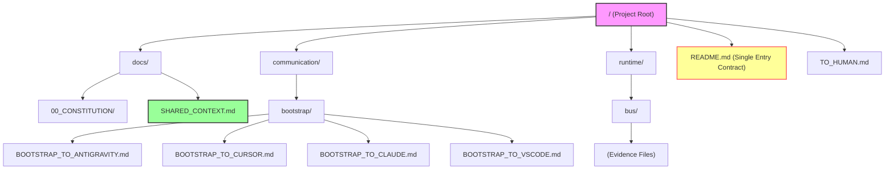

# Project Structure Map

> [!NOTE]
> This file maps the high-level folder structure of the **Poly-Tech2** system.
> **Last Updated**: 2025-12-27



## detailed Tree View

```text
/
├── README.md                   <-- [Single Entry Contract]
├── TO_HUMAN.md                 <-- [Status Report]
├── PROJECT_STRUCTURE.md        <-- [This File]
├── communication/
│   └── bootstrap/              <-- [Agent Onboarding Templates]
│       ├── BOOTSTRAP_TO_ANTIGRAVITY.md
│       ├── BOOTSTRAP_TO_CLAUDE.md
│       ├── BOOTSTRAP_TO_CURSOR.md
│       └── BOOTSTRAP_TO_VSCODE.md
├── docs/
│   ├── SHARED_CONTEXT.md       <-- [Session Baseline]
│   └── 00_CONSTITUTION/        <-- [Governance Rules]
│       ├── CONSTITUTION.md
│       ├── ROLE_MODEL.md
│       ├── WORKFLOW.md
│       └── ...
├── runtime/
│   └── bus/                    <-- [Execution Evidence]
└── message/                    <-- [Legacy Prompts]
```
