# Monet Registry Folder Structure

Overview of the `monet-registry-main` directory, highlighting key functional areas.

```mermaid
graph TD
    Root["/monet-registry-main"]
    
    %% Core Source Code
    Root --> Src["/src (Application Core)"]
    Src --> App["/app (Next.js App Router)"]
    Src --> Components["/components (React Components)"]
    Src --> Config["/config (App Configuration)"]
    Src --> Lib["/lib (Utilities & Logic)"]
    Src --> Styles["/styles (Global Styles)"]

    %% Documentation & Guides
    Root --> Docs["/docs (Project Documentation)"]
    Docs --> Pipelines["Pipeline Guides (Scraping, Registry)"]
    
    %% AI & Automation Data
    Root --> Prompts["/prompt (AI Prompts)"]
    Root --> Data["/data (Seed/Example Data)"]
    Root --> AgentInput["/agent-input (Agent Workflows)"]

    %% Configuration & Tooling
    Root --> Scripts["/scripts (Utility Scripts)"]
    Root --> Public["/public (Static Assets)"]
    Root --> E2E["/e2e (End-to-End Tests)"]
    
    %% Root Config Files
    Root --> ConfigFiles["Configuration Files"]
    ConfigFiles --> NextConfig["next.config.ts"]
    ConfigFiles --> PkgJson["package.json"]
    ConfigFiles --> Env["env files"]
```

## Directory Details

- **`src/`**: The main application codebase.
  - **`app/`**: Next.js 13+ App Router directory containing pages and layouts.
  - **`components/`**: Reusable UI components (likely Shadcn UI or similar).
  - **`lib/`**: Shared utility functions and business logic.
  
- **`docs/`**: Documentation for developers.
  - Contains guides on "URL to Registry" pipelines and customization.

- **`prompt/`**: Stores prompt templates used for AI generation tasks (e.g., `img-to-component.md`, `url-to-page.md`).

- **`data/`**: Input data files (e.g., `unsection-hero.md`), possibly serving as seeds or examples for the AI generation.

- **`agent-input/`**: Directory for inputs specifically designed for AI agents to process.

- **`e2e/`**: Testing directory, likely containing Playwright or Cypress tests.

- **`scripts/`**: Helper scripts for maintenance, data processing, or setup tasks.
